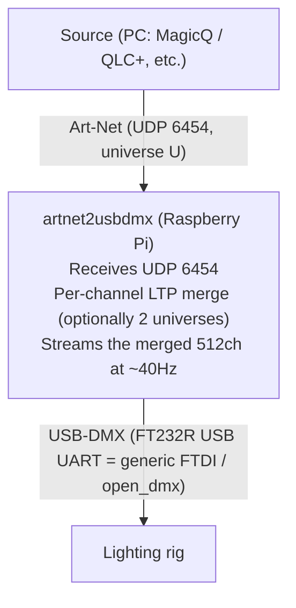

# artnet2usbdmx — Art-Net → USB-DMX bridge

[日本語](README.md) | **English**

A minimal tool that **receives Art-Net (UDP 6454) on a Raspberry Pi (or any Linux/PC) and
continuously streams DMX512 out of a USB-DMX interface** (generic FTDI such as the FT232R, or
an Enttec DMX USB Pro).

It bridges Art-Net from lighting consoles / visualizers (MagicQ, QLC+, etc.) straight to real
fixtures. Dependencies are minimal (mostly the standard library), and it starts safely in
dry-run mode even when no USB-DMX device is connected.



## Features

- **Art-Net (ArtDMX) in → continuous DMX512 out.** Even if reception stalls, the last values keep being sent at `refresh_hz` (default 40Hz).
- **USB auto-detection (hotplug aware):** scans for known DMX USB devices (VID:PID, e.g. FTDI FT232R `0403:6001`); transmits once found, stops when unplugged.
- **2-universe LTP merge (optional):** make two sources redundant and adopt, per channel, the stream that changed last. Output continues even if one stream goes stale.
- **Safety first:** `dry_run` mode never writes a single byte to USB. If `pyserial` is not installed it automatically falls back to dry-run instead of crashing.
- **Status display:** console / web (HTTP) / none. Shows receive rate, stale state, the first merged DMX values, and the failover history.

## Repository layout

```
artnet2usbdmx/
  common/        # ArtDMX parsing, DMX framing/driver, LTP merge, config loader (HW-independent)
  receiver/      # Art-Net receive, LTP merge, USB-DMX output, status display, CLI
  systemd/       # systemd unit + FTDI udev rule
  config.example.yaml
  requirements.txt
  LICENSE
  CHANGELOG.md
  README.md       # Japanese (primary)
  README.en.md    # English
```

## Requirements

- Python 3.10+ (3.11+ recommended on real hardware).
- Dependencies (only for actual DMX output and YAML loading):
  - `PyYAML` (config YAML)
  - `pyserial` (USB-DMX output; falls back to dry-run automatically if absent)
  - `pyftdi` (optional; only when you need the more accurate BREAK/MAB of Open DMX)
- The pure logic in `common/` runs with no extra dependencies (standard library only).

```bash
pip install -r requirements.txt
# On Raspberry Pi OS, apt works too: sudo apt-get install -y python3-yaml python3-serial
```

## Configuration

Copy `config.example.yaml` to `config.yaml`. Every key has a default, so you only need to set
what you care about. From the CLI you can override individual keys with `--set a.b.c=value`
(repeatable).

| Key | Default | Description |
|---|---|---|
| `artnet.universe` | 0 | Port-Address of stream A to receive. **Must match the sender's universe.** |
| `artnet.stream_offset` | 1 | Stream B = universe + offset (only meaningful for 2-universe LTP merge) |
| `artnet.port` | 6454 | Standard Art-Net UDP port |
| `receiver.bind_ip` | `""` | Bind IP for receiving (`""` = all interfaces). Set only to restrict to a specific NIC. |
| `receiver.stale_timeout_ms` | 800 | A stream with no update for this long is dropped from the merge. With one source, B being stale is normal. |
| `receiver.refresh_hz` | 40 | Continuous DMX output rate (keeps sending the last values even if reception stalls) |
| `receiver.dmx.driver` | open_dmx | `open_dmx` (generic FTDI such as FT232R) / `enttec_pro` / `auto` (inferred from description) |
| `receiver.dmx.port` | **auto** | `auto` = USB auto-detect (follows connect/disconnect, sends nothing if none); fixed e.g. `/dev/ttyUSB0` |
| `receiver.dmx.dry_run` | false | **true never writes anything to USB (the safety switch for testing; highest priority).** |
| `receiver.status.mode` | console | `console` / `web` (web_port) / `none` |

## Running

### Manual start

```bash
cd artnet2usbdmx
# Normal start
python3 -m receiver --config config.yaml
# Try it without hardware (never writes to USB)
python3 -m receiver --dry-run --set receiver.status.mode=console
```

Common CLI: `--config PATH` / `--set KEY=VALUE` (repeatable) / `--log-level LEVEL` / `--dry-run`.
Stops cleanly on SIGINT/SIGTERM.

### Running as a systemd service

Assuming the repository lives at `/home/pi/artnet2usbdmx`:

```bash
sudo cp systemd/artnet2usbdmx.service /etc/systemd/system/
sudo cp systemd/99-ftdi-dmx.rules /etc/udev/rules.d/ && sudo udevadm control --reload && sudo udevadm trigger
sudo systemctl daemon-reload
sudo systemctl enable --now artnet2usbdmx

# Status & logs
systemctl status artnet2usbdmx
journalctl -u artnet2usbdmx -f
```

## Network / wiring (direct PC connection example)

The minimal setup: a PC sends Art-Net over wired LAN directly, and DMX comes out of USB.

1. **Physical link:** connect the PC's (USB-)LAN ⇄ the Pi's `eth0` directly with a LAN cable (between two GbE ports a straight cable works thanks to Auto MDI-X).
2. **Static IP** (no DHCP on a direct link): set the Pi's `eth0` to `10.0.0.2/24`. Give the PC NIC **a different IP in the same subnet** (e.g. `10.0.0.1/24`).
   - Where to set it: **Windows** Settings → Ethernet → IP assignment "Edit" → Manual → IPv4 / **macOS** Network → the adapter → Details → TCP/IP → Manually / **Linux** `sudo ip addr add 10.0.0.1/24 dev <if> && sudo ip link set <if> up`.
3. **Check connectivity:** `ping 10.0.0.2`.
4. **Sender settings:** destination unicast `10.0.0.2` (or broadcast `10.0.0.255`) / **Universe = `artnet.universe` (default 0)** / **UDP 6454** / pin the source NIC to the `10.0.0.x` adapter / allow UDP 6454 and the sender app in the OS firewall.

**MagicQ notes:**
- Set the node IP to `10.0.0.x` with subnet mask `255.255.255.0`. **If you leave the Art-Net defaults `2.x.x.x` / `255.0.0.0`, the subnet won't match and packets won't arrive.**
- **The gateway field cannot be left empty** → on a direct link it isn't actually used, so enter **an unused IP in the same subnet** (e.g. `10.0.0.254`, not colliding with the Pi's `.2`).

## Hardware / wiring (USB-DMX)

- **Device:** FT232R USB-UART (VID:PID **`0403:6001`**) = generic FTDI. `driver: open_dmx`. `port: auto` scans known DMX VID:PIDs (`0403:6001/6010/6011`, etc.) and is **hotplug aware**; fixed is `/dev/ttyUSB0`.
- **Method (open_dmx):** **250kbaud / 8N2**. Unlike the Enttec Pro, the device has no timing-generation firmware, so the **host generates BREAK (~176µs) → MAB (~12µs) → start code (0x00) + 512ch** and streams it continuously.
- **latency_timer:** the FTDI default of 16ms coalesces small writes and jitters the DMX frame interval. **Lowering it to 1ms** stabilizes things (install `systemd/99-ftdi-dmx.rules`). The service (pi) can't write to sysfs, so make it permanent via udev. Manually: `echo 1 | sudo tee /sys/bus/usb-serial/devices/ttyUSB0/latency_timer`. If it's still rough, consider pyftdi.
- **Permissions:** `/dev/ttyUSB0` belongs to group `plugdev` (+`dialout`). The systemd unit already grants `SupplementaryGroups=dialout plugdev`. For manual runs: `sudo usermod -aG dialout,plugdev pi`.
- **XLR wiring:** DMX uses XLR **Pin1=GND / Pin2=Data− / Pin3=Data+** (cheap USB-DMX units are 3-pin; console-grade gear can be 5-pin). A **120Ω terminator at the end of the line** stabilizes long runs. Don't mix with power/audio XLR cables.

## Reading the status line

In console mode the status is printed on a single line:

```
A[ok 40Hz age=12 f=120]  B[---- 0Hz age=- f=0] | DMX1-8=[..] | tx=N rx=a/b
```

- `A`/`B` … state of stream A (univ U) / stream B (univ U+offset). `ok`/`----` (not received / stale), the rate, `age` = time since last reception, `f` = received frame count.
- `DMX1-8` … merged output values for ch1–8. `tx` … cumulative DMX sends (**if it keeps climbing, the output loop is alive**). `rx=a/b` … receive counts for stream A/B.
- **With a single source, `B[----]` is normal.** If `A[ok ..]` shows and the values you sent appear in `DMX`, the receive-to-output path is working.

## 2-universe LTP merge (optional)

For redundancy, have a second node (or a separate output) send on **`universe + stream_offset`
(default 1)**, and the receiver LTP-merges A(U)/B(U+1) per channel. If one stream goes silent
beyond `stale_timeout_ms`, DMX output continues from the other (recovery is detected too).

> If two nodes send the *same* universe simultaneously, both are treated as "stream A" and fight
> over it (A/B are distinguished by universe, not by source IP).

## Safety

While running with `dry_run:false` and real fixtures connected, **the values of the received
universe go straight to the real lights**. To check connectivity only, physically disconnect the
fixtures, or temporarily use `--set receiver.dmx.dry_run=true` and just watch the `rx` counter
climb.

## Troubleshooting

| Symptom | Check / fix |
|---|---|
| `rx=0/0`, nothing received | ① Is the PC's sending NIC on that LAN (`10.0.0.x`)? ② `universe` match ③ Subnet match (both PC/Pi on `10.0.0.0/24`) ④ Firewall allows UDP 6454 ⑤ Destination (unicast `10.0.0.2` or broadcast `10.0.0.255`) |
| Nothing arrives from MagicQ | Is the node IP still `2.x.x.x`? Is the gateway in the same subnet? Is the source NIC the right adapter? |
| No DMX out (but receiving is OK) | Is `dry_run:false`? Is `/dev/ttyUSB0` detected (`lsusb \| grep 0403:6001`)? `plugdev`/`dialout` permissions |
| DMX stutters / unstable | Lower the FTDI `latency_timer` to 1ms (install `systemd/99-ftdi-dmx.rules`). If still rough, consider pyftdi |
| pyserial not installed | Falls back to dry-run automatically (warns in the log). For real output, `pip install pyserial` |
| Want to receive stream B (2-stream test) | Send from a second node / separate output on `universe + stream_offset` (default 1) |

## Out of scope

NDI / video, RDM, large-scale patching, VLAN / L3 routing, Art-Net *sending* (this tool focuses
on receive → DMX output).

## License

[MIT License](LICENSE) © 2026 4ltena
