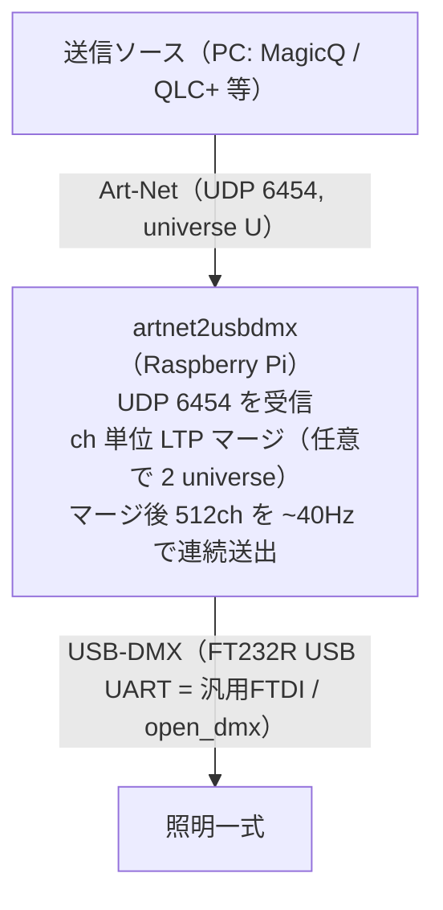

# artnet2usbdmx — Art-Net → USB-DMX 変換

**日本語** | [English](README.en.md)

Raspberry Pi（や任意の Linux/PC）で **Art-Net(UDP 6454) を受信し、USB-DMX インターフェイス
（FT232R 等の汎用 FTDI / Enttec DMX USB Pro）から DMX512 を連続送出する**最小構成のツール。

照明卓・ビジュアライザ（MagicQ, QLC+ 等）からの Art-Net をそのまま実照明へ橋渡しする。
追加依存はほぼ無く（標準ライブラリ中心）、USB-DMX が未接続でも安全に dry-run で起動する。



## 特徴

- **Art-Net(ArtDMX) 受信 → DMX512 連続送出**。受信が途切れても直近値を `refresh_hz`（既定 40Hz）で送り続ける。
- **USB 自動検出（ホットプラグ追従）**: 既知の DMX 用 USB(VID:PID, FTDI FT232R `0403:6001` 等)を走査し、見つけたら送信、抜けたら停止。
- **2 universe の LTP マージ（任意）**: 2 つの送信ソースを冗長化し、ch 単位で「最後に変更した系統」を採用。片系統が途絶(stale)しても出力は継続する。
- **安全第一**: `dry_run` で USB へ一切書き込まない検証モード。pyserial 未導入時も自動で dry-run にフォールバックし落ちない。
- **状態表示**: console / web(HTTP) / none。受信レート・stale・マージ後 DMX 先頭値・フェイルオーバー履歴を確認できる。

## リポジトリ構成

```
artnet2usbdmx/
  common/        # ArtDMX パース・DMX フレーミング/ドライバ・LTPマージ・設定ローダ（HW非依存）
  receiver/      # ArtNet 受信、LTPマージ、USB-DMX 出力、状態表示、CLI
  systemd/       # systemd unit + FTDI udev ルール
  config.example.yaml
  requirements.txt
  LICENSE
  CHANGELOG.md
  README.md       # 日本語（主）
  README.en.md    # English
```

## 必要環境

- Python 3.10+（実機は 3.11+ 推奨）。
- 依存（実機での DMX 出力と YAML 読み込みのみ）:
  - `PyYAML`（設定 YAML）
  - `pyserial`（USB-DMX 出力。未導入なら自動で dry-run にフォールバック）
  - `pyftdi`（任意。Open DMX のより正確な BREAK/MAB が必要な場合のみ）
- `common/` の純粋ロジックは追加依存なし（標準ライブラリのみ）で動作。

```bash
pip install -r requirements.txt
# Raspberry Pi OS なら apt でも可: sudo apt-get install -y python3-yaml python3-serial
```

## 設定

`config.example.yaml` をコピーして `config.yaml` を作る。全項目に既定値があるため必要箇所だけでよい。
CLI からは `--set a.b.c=値`（複数可）で個別上書きできる。

| キー | 既定 | 説明 |
|---|---|---|
| `artnet.universe` | 0 | 受信する系統A の Port-Address。**送信ソフトの universe と一致必須** |
| `artnet.stream_offset` | 1 | 系統B = universe + offset（2系統 LTP マージ時のみ意味を持つ） |
| `artnet.port` | 6454 | Art-Net 標準 UDP ポート |
| `receiver.bind_ip` | `""` | 受信バインド IP（`""`=全IF）。複数 NIC で限定したいときだけ設定 |
| `receiver.stale_timeout_ms` | 800 | この時間更新が無い系統をマージ対象外に。1ソースでは B が常に stale=正常 |
| `receiver.refresh_hz` | 40 | DMX 連続送出レート（受信が途切れても直近値を送り続ける） |
| `receiver.dmx.driver` | open_dmx | `open_dmx`(FT232R 等の汎用FTDI) / `enttec_pro` / `auto`(説明から推定) |
| `receiver.dmx.port` | **auto** | `auto`=USB自動検出（接続/切断に追従、無ければ送信しない）/ 固定は `/dev/ttyUSB0` |
| `receiver.dmx.dry_run` | false | **true で USB へ一切書き込まない（検証時の安全装置・最優先）** |
| `receiver.status.mode` | console | `console` / `web`(web_port) / `none` |

## 実行方法

### 手動起動

```bash
cd artnet2usbdmx
# 通常起動
python3 -m receiver --config config.yaml
# HW なしで試す（USB へ書き込まない）
python3 -m receiver --dry-run --set receiver.status.mode=console
```

CLI 共通: `--config PATH` / `--set KEY=VALUE`(複数可) / `--log-level LEVEL` / `--dry-run`。
SIGINT/SIGTERM で安全停止する。

### systemd 常駐

リポジトリを `/home/pi/artnet2usbdmx` に置く前提:

```bash
sudo cp systemd/artnet2usbdmx.service /etc/systemd/system/
sudo cp systemd/99-ftdi-dmx.rules /etc/udev/rules.d/ && sudo udevadm control --reload && sudo udevadm trigger
sudo systemctl daemon-reload
sudo systemctl enable --now artnet2usbdmx

# 状態・ログ
systemctl status artnet2usbdmx
journalctl -u artnet2usbdmx -f
```

## ネットワーク / 配線手順（PC 直結の例）

PC から有線 LAN で直接 Art-Net を送って USB-DMX 出力する最小構成。

1. **物理結線**: PC の(USB-)LAN ⇄ Pi `eth0` を LAN ケーブルで直結（GbE 同士ならストレート可・Auto MDI-X）。
2. **固定IP**（直結は DHCP 無し）: Pi `eth0` を `10.0.0.2/24` 静的に。PC 側 NIC に**同一サブネットの別IP**（例 `10.0.0.1/24`）を振る。
   - 設定箇所: **Windows** 設定→イーサネット→IP割り当て「編集」→手動→IPv4／ **macOS** ネットワーク→該当アダプタ→詳細→TCP/IP→手動／ **Linux** `sudo ip addr add 10.0.0.1/24 dev <if> && sudo ip link set <if> up`。
3. **疎通確認**: `ping 10.0.0.2`。
4. **送信ソフト設定**: 宛先 unicast `10.0.0.2`（または broadcast `10.0.0.255`）／ **Universe = `artnet.universe`（既定 0）** ／ **UDP 6454** ／ 送信元 NIC を `10.0.0.x` の当該アダプタに固定／ OS ファイアウォールで UDP6454・送信ソフトを許可。

**MagicQ の注意**:
- 本体IPを `10.0.0.x`、サブネットマスク `255.255.255.0` に。**Art-Net 既定の `2.x.x.x`/`255.0.0.0` のままだとサブネットが違って届かない**。
- **ゲートウェイ欄は空にできない** → 直結では実際に使われないので、**同一サブネット内の未使用IP**（例 `10.0.0.254`、Pi の `.2` と重複しない値）を入れる。

## ハード / 配線（USB-DMX）

- **デバイス**: FT232R USB-UART（VID:PID **`0403:6001`**）＝汎用FTDI。`driver: open_dmx`。`port: auto` は既知の DMX 用 VID:PID（`0403:6001/6010/6011` 等）を走査し**ホットプラグ追従**、固定は `/dev/ttyUSB0`。
- **方式（open_dmx）**: **250kbaud / 8N2**。Enttec Pro と違いデバイスにタイミング生成FWが無いため、**ホスト側で BREAK(~176µs)→MAB(~12µs)→スタートコード(0x00)+512ch** を生成して連続送出する。
- **latency_timer**: FTDI 既定 16ms は小さい書き込みをまとめてしまい DMX フレーム間隔がジッタする。**1ms に下げる**と安定（`systemd/99-ftdi-dmx.rules` を導入）。サービス(pi)からは sysfs に書けないため udev で恒久化する。手動なら `echo 1 | sudo tee /sys/bus/usb-serial/devices/ttyUSB0/latency_timer`。それでも厳しければ pyftdi を検討。
- **権限**: `/dev/ttyUSB0` は group `plugdev`（+`dialout`）。systemd unit は `SupplementaryGroups=dialout plugdev` で付与済み。手動実行時は `sudo usermod -aG dialout,plugdev pi`。
- **XLR配線**: DMX は XLR の **Pin1=GND / Pin2=Data− / Pin3=Data+**（安価なUSB-DMXは3ピン、調光卓系は5ピンもある）。ライン**終端に 120Ω 終端抵抗**を入れるとロングランで安定。電源/オーディオ用XLRケーブルと混用しない。

## 状態行の読み方

console モードでは 1 行で状態を出力する:

```
A[ok 40Hz age=12 f=120]  B[---- 0Hz age=- f=0] | DMX1-8=[..] | tx=N rx=a/b
```

- `A`/`B` … 系統A(univ U) / 系統B(univ U+offset) の状態。`ok`/`----`(未受信・stale)、レート、`age`=最終受信からの経過、`f`=受信フレーム数。
- `DMX1-8` … マージ後 ch1-8 の出力値。`tx` … DMX 送出累計（**増え続けていれば出力ループは生きている**）。`rx=a/b` … 系統A/B の受信数。
- **1 ソース運用では `B[----]` が正常**。`A[ok ..]` と `DMX` に送った値が出れば受信〜出力まで成立。

## 2 universe の LTP マージ（任意）

冗長化したい場合、2 台目（または別出力）を **`universe + stream_offset`（既定 1）** で送ると、
receiver が A(U)/B(U+1) を ch 単位で LTP マージする。片系統が `stale_timeout_ms` を超えて
途絶しても、もう一方の系統で DMX 出力を継続する（復帰も検知）。

> 同じ universe を 2 台が同時送出すると両方とも「系統A」扱いになり奪い合う（A/B は universe で区別し、送信元IPでは区別しない）。

## 安全

実照明が接続された状態で `dry_run:false` 稼働中は、**届いた universe の値がそのまま実照明に出る**。
疎通だけ確認したいときは、照明を物理的に外すか、一時的に `--set receiver.dmx.dry_run=true` で
`rx` カウンタの増加だけを確認すること。

## トラブルシュート

| 症状 | 確認 / 対処 |
|---|---|
| `rx=0/0` のまま受信しない | ① PC 送信NICが当該LAN(`10.0.0.x`)か ② `universe` 一致 ③ サブネット一致（PC/Pi とも `10.0.0.0/24`）④ FW で UDP6454 許可 ⑤ 宛先（unicast `10.0.0.2` or broadcast `10.0.0.255`） |
| MagicQ から届かない | 本体IPが `2.x.x.x` のままでないか、ゲートウェイが同一サブネットか、送信元NICが当該アダプタか |
| DMX が出ない（受信はOK） | `dry_run:false` か、`/dev/ttyUSB0` が検出されているか（`lsusb \| grep 0403:6001`）、`plugdev`/`dialout` 権限 |
| DMX がカクつく/不安定 | FTDI `latency_timer` を 1ms に（`systemd/99-ftdi-dmx.rules` 導入）。それでも厳しければ pyftdi を検討 |
| pyserial 未導入 | 自動で dry-run にフォールバック（ログに警告）。実出力するなら `pip install pyserial` |
| 系統B を受けたい（2系統検証） | 2 台目/別出力を `universe + stream_offset`（既定1）で送る |

## スコープ外

NDI / 映像系、RDM、大規模パッチ、VLAN / L3 ルーティング、Art-Net 送信（本ツールは受信→DMX 出力に特化）。

## ライセンス

[MIT License](LICENSE) © 2026 4ltena
